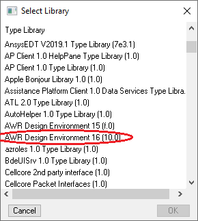

# Working With the AWRDE API 
This is a simple writeup of how to set up and use the AWR Design Environment (AWRDE) API to analyze circuits with Python.

## Description
The AWR Design Environment (AWRDE) contains a built-in Scripting Development Environment (SDE) based on the SAX Basic programming language. Scripting enables easy automation of tasks and facilitates data retrieval, which can help with data analysis and presentation. SAX Basic is compatible with Visual Basic for Applications (VBA). 

AWRDE has an extensive API, and with a little work, the commands available through VBA can also be accessed by Python, opening up the possibility of using the large body of open-source libraries and tools written for Python to retrieve and parse AWR specialized data data. The API also enables programmatic alteration of values and inputs used in simulations, allowing a scipt to dynamically optimize these values in response to the data that it recieves from AWR.

## Getting Started

### Prerequisites

This process was tested with Windows 10 Home, AWRDE 15 and 16, and Python 3.8.10. Officially the requirements are as follows:

* **Python 3.7** or later
   * Python can be downloaded either from [Python Org](https://www.python.org/) or from [Anaconda](https://www.anaconda.com/). If installing directly from Python Org, your Python install directory and the `/Scripts` directory should both be added to your 'PATH' Environemental Variable in Windows.  
   
     NOTE 1: The Anaconda installation guide recommends against adding Anaconda Python to your `PATH`; instead the proper libraries can be installed in the Conda environment in which your code will run, and the appropriate environment can be selected in your IDE or activated before executing your code. That said, Anaconda's installation was the only Python installation *I used* and so I added it to my `PATH` anyways.  
   
     NOTE 2: To the best of my knowledge, [pypiwin32](https://pypi.org/project/pypiwin32/) is not available on Conda channels. Initially, I installed the packages I could with the Conda package manager and the rest with PIP. This is also generally recommended against, since PIP and Conda don't always play nice together, but it worked for me. See more detail below.

* **pip3** is included by default with the Python binary installers starting with Python 3.4. You may need to install it explicitly if you're not using a Conda environment, though it's also a requirement for installing **pywin32** (below) so if going that route, Conda will install it for you.

* **Python IDE** an integrated development environment which supports code completion will be very helpful for working with the AWRDE API. VScode with the Python extension is recommended by AWR, (and is what I used), but they also note that
  >   PyCharm, Spyder, and Wing are IDEs that have been verified to work with pyawr and code-completion. 

### Installing [**pywin32**](https://pypi.org/project/pywin32/) 

From the package description:  
   >  The Python for Win32 (pywin32) extension provides access to many of the Windows APIs from Python.
   >  ## Binaries 
   >  By far the easiest way to use pywin32 is to grab binaries from the [most recent release.](https://github.com/mhammond/pywin32/releases)
   >  ## Installing via PIP
   >  You can install pywin32 via pip: `pip install pywin32`.
   >  Note that if you want to use pywin32 for “system wide” features, such as registering COM objects or implementing Windows Services, then you must run the following command from an elevated command prompt:
   >  `python Scripts/pywin32_postinstall.py -install`.  

However, the [guide published by AWR](https://kb.awr.com/display/awrscripts/AWR+Scripting+in+Python) instructs that [**py*pi*win32**](https://pypi.org/project/pypiwin32/) should be installed with `pip` instead. It is not available on any Conda channels as far as I know.  

That said, **pypiwin32** is [apparently outdated:](https://stackoverflow.com/questions/55918311/what-is-the-difference-between-pywin32-and-pypiwin32)
  >   Pypiwin32 is an old and outdated repackaging of pywin32 from its creator to use wheels. It is abandoned for a long time. You should just use pywin32.

I was able to set up *just* pywin32 in a Conda virtual environment as follows.
* Open a terminal window and activate the conda environment with `conda activate <your_env_name>` (or if you don't have Anaconda in your 'PATH' open an Anaconda terminal through the gui.)
* Install version 222 of pywin32 with `conda install pywin32==222`  
  Note that this is not the newest version of pywin32. For resasons that remain unclear to me, newer versions don't install properly.
* Open a command prompt with Administrator privileges.
* Again, activate your conda environment.
* Navigate to `<your_anaconda_environment_location>/Scripts`. 
  * If not using an Anaconda environment this will be in the same directory as your python.exe (try `where python`.)
* Run `python pywin32_postinstall.py -install`.
* Return to your other terminal.
* Navigate to `<your_anaconda_environment_location>/Lib/site-packages/win32com/client`.
  * If not using an Anaconda environment, the same note as above applies.
* Run `python makepy.py`.
* This will pull up a window that looks like this:  
  
  
* Select the appropriate library (circled, in my case) and click "OK".

NOTE: As mentioned above, the [official scripting guide](https://kb.awr.com/display/awrscripts/AWR+Scripting+in+Python) published by AWR has a slightly different procedure that uses the outdated **pypiwin32** library installed with `pip`. You will still need to navigate to your `<python install directory>/Lib/site-packages/win32com/client` and run `python makepy.py` to set up the library to work with AWRDE if you choose to follow that guide.
   
### Installing pyawr

[**pyawr**](https://pypi.org/project/pyawr/) is a package which incorporates win32com, the library which handles interfacing between the Python and Windows' [COM interface](https://en.wikipedia.org/wiki/Component_Object_Model), which allows different applications to "talk to" each other. To the best of my knowledge it is not availble though any Conda channels. With pywin32 sucessfully installed and the appropriate environment active, we can install pyawr with pip.
* `pip install pyawr`. 

### Testing pyawr

Here's an example Python script to verify that pyawr works properly:
* Open AWRDE and then open the built-in example LPF_Lumped.emp
* Run the Python script.  
* In the Python output terminal, the text output should be: `LPF`.
```
import pyawr.mwoffice as mwo
awrde = mwo.CMWOffice()
 
NumSchem = awrde.Project.Schematics.Count
for s_idx in range(NumSchem):
    schem = awrde.Project.Schematics[s_idx]
    print(schem.Name)
```

## Working with the AWRDE API in Python
For working with AWRDE, the best reference is [The AWRDE API Scripting Guide](https://kb.awr.com/display/awrscripts/Python+Using+the+AWRDE+API+Scripting+Guide). 

### Tutorial
The scripting guide covers some of these steps in some detail, but for comprehensiveness, there's a [Jupyter notebook with a quick tutorial](./AWRDE_Tutorial.ipynb) in the same folder as this README.  

If you already have a circuit built and the project frequency sweep specified and graphs added, you can try:
```
import pyawr.mwoffice as mwo`                  #import awr module
awrde = mwo.CMWOffice()                        #create awrde object
```
in your IDE. Once this is done, you can start messing around with code completion to see how to do useful things.  


Another reference is the API which is in pdf form and also not written for Python, making it a challenge to use on its own. I've uploaded the file to this github and [linked it here](./ApiReference.pdf).

## Authors

Sergei Zvenigorodsky  
<serge.zvenig@gmail.com>

## References

Much of this infomration was adapted from [AWRDE Python Scripting guide](https://kb.awr.com/display/awrscripts/Python) which is definitely recommended ~~reading~~ skimming.  
Readme template from [README-Template.md](https://gist.github.com/DomPizzie/7a5ff55ffa9081f2de27c315f5018afc)
